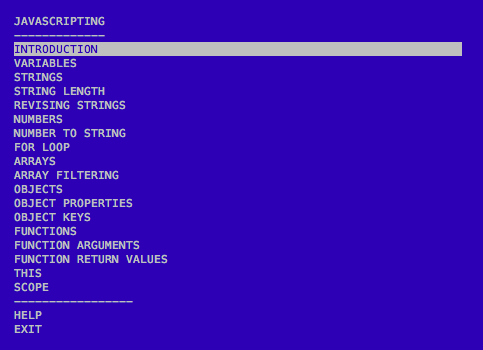

# JAVASCRIPTING

> Learn JavaScript by adventuring around in the terminal.  

> _Looking for more interactive tutorials like this? Go to [nodeschool.io](http://nodeschool.io)._

## Get help
Having issues with javascripting? Get help troubleshooting in the [nodeschool discussions repo](https://github.com/nodeschool/discussions),
on [gitter](https://gitter.im/nodeschool/discussions) or in [repository issues](https://github.com/workshopper/javascripting/issues)

Also, take a look into our [troubleshooting documentation](https://github.com/workshopper/javascripting/blob/master/TROUBLESHOOTING.md)

## Install Node.js

Make sure Node.js is installed on your computer.

Install it from [nodejs.org](https://nodejs.org/)

### Install `javascripting` with `npm`

Open your terminal and run this command:

```
npm install -g javascripting
```

The `-g` option installs this module globally so that you can run it as a command in your terminal.

## Run the workshop

Open your terminal and run the following command:

```
javascripting
```

You'll see the menu:



Navigate the menu with the up & down arrow keys. 

Choose a challenge by hitting enter.

### Take a look at this gif that shows the first challenge:


In the gif I'm using the command line editor `nano` ([here are some basic usage tips for nano](https://github.com/sethvincent/dev-envs-book/blob/master/chapters/05-editors.md#nano)).  

You can use any editor you like. 

[atom](http://atom.io) or [brackets](http://brackets.io/) are both good options.

## Need help with an exercise?

Open an issue in the [nodeschool/discussions repo](https://github.com/nodeschool/discussions)

Include the name `javascripting` and the name of the challenge you're working on in the title of the issue.

## Get Involved

Code contributions welcome! Please check our [documentation on contributing](https://github.com/workshopper/javascripting/blob/master/CONTRIBUTING.md) to get started.

## License

MIT
